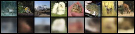

# Variational-Autoencoder
my implmentation of variational autoencoder built using pytorch

based upon [Auto-Encoding Variational Bayes (arXiv:1312.6114)](https://arxiv.org/pdf/1312.6114)

Trained and evaluated on the publicly available CIFAR-10 dataset [60k 32x32x3 images of over 10k classes]

## Reconstructions comparison (top - dataset image, bottom - reconstruction)

 (latent dim size - 32, 30 epochs)
.png)

## Randomly Sampled latents from prior distribution

.png)

The blur in the images is the standard behaviour for VAEs, further improvements can be made using GANs and Diffusion models
